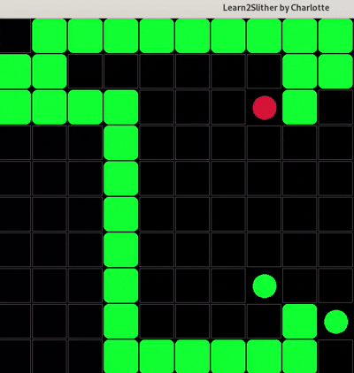
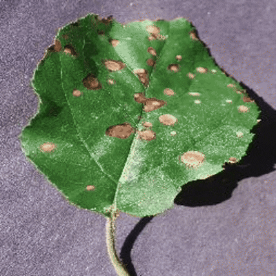
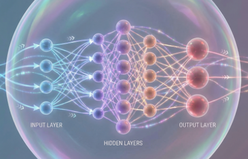
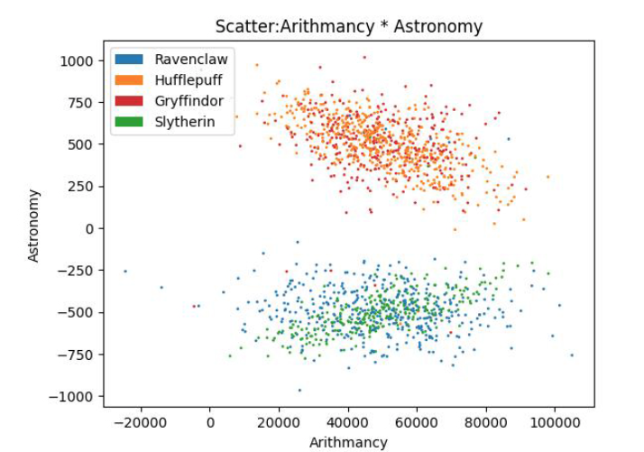
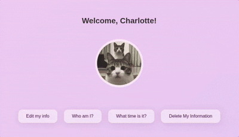
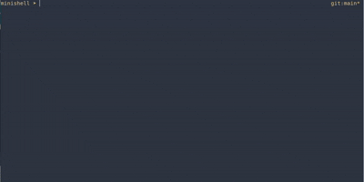

   <h3>Hi, I'm Charlotte 👋</h3>
  
I'm currently completing a Master's degree in <b>AI and Algorithms</b> at <b>42 Paris</b>.

   

  

    

   
# Projects 👩‍💻

## AI & ML 🤖

| [Learn2Slither](https://github.com/Roychrltt/Learn2Slither) | [Leaffliction](https://github.com/swangarch/leaffliction) |
|:---:|:---:|
|  |  |
| A reinforcement learning project that trains an AI agent to play the classic Snake game. | A computer vision project using CNN to identify leaf diseases |
| | |
| [Multilayer Perceptron](https://github.com/Roychrltt/MultilayerPerceptron) | [DSLR](https://github.com/swangarch/DSLR) |
|  |  |
| A MLP built from scratch without using any high-level ML libraries | Implemented binary classification with one-vs-all strategy using logistic regression |

## Low Level ⚙️

| [Webserv](https://github.com/pquline/webserv) | [minishell](https://github.com/Roychrltt/minishell) |
|:---:|:---:|
|  |  |
| A lightweight, fast HTTP/1.1 server in C++ | A lightweight UNIX shell implemented in C, inspired by bash. |

<h3 align="center">🛠️ Languages & Tools</h3>

   

      
    
   
  
   

<h3 align="center">🎯 Competitive Programming</h3>

  
  &nbsp;&nbsp;&nbsp;&nbsp;
  

  
   
   

 

  

